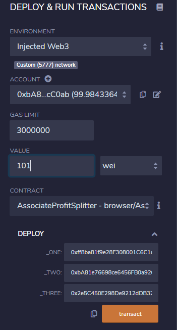
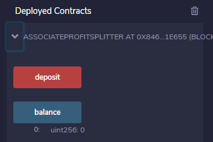
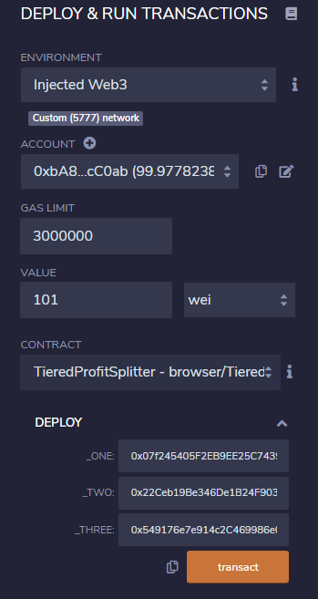
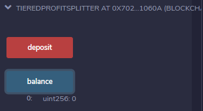
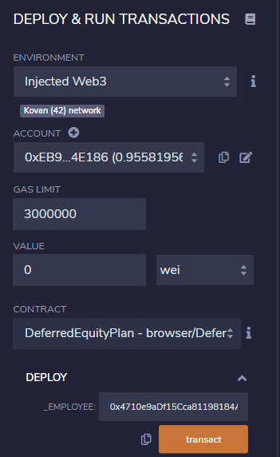

# Profit-Splitter-Contract

In these contracts, we are trying to build profit/share splitting within  a company The contracts have 3 levels

## Contracts Files
AssociateProfitSplitter.sol

TieredProfitSplitter.sol 

DeferredEquityPlan.sol 

## Level 1:Profit Splitter Among Employee.
AssociateProfitSplitter.sol

Level One is an AssociateProfitSplitter contract. This will accept Ether into the contract and divide the Ether evenly among the associate level employees. This will allow the Human Resources department to pay employees quickly and efficiently.

## Level 2:Profit Splitter Among CEO, CTO, Bob.
TieredProfitSplitter.sol 

Level Two is a TieredProfitSplitter that will distribute different percentages of incoming Ether to employees at different tiers/levels. For example, the CEO gets paid 60%, CTO 25%, and Bob gets 15%.

## Level 3:Profit Splitter Among CEO, CTO, Bob.
DeferredEquityPlan.sol 

Level Three is a DeferredEquityPlan that models traditional company stock plans. This contract will automatically manage 1000 shares with an annual distribution of 250 over 4 years for a single employee.

